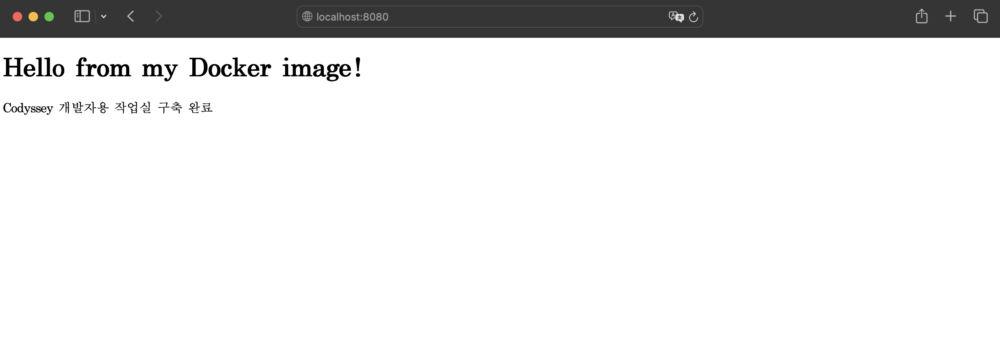
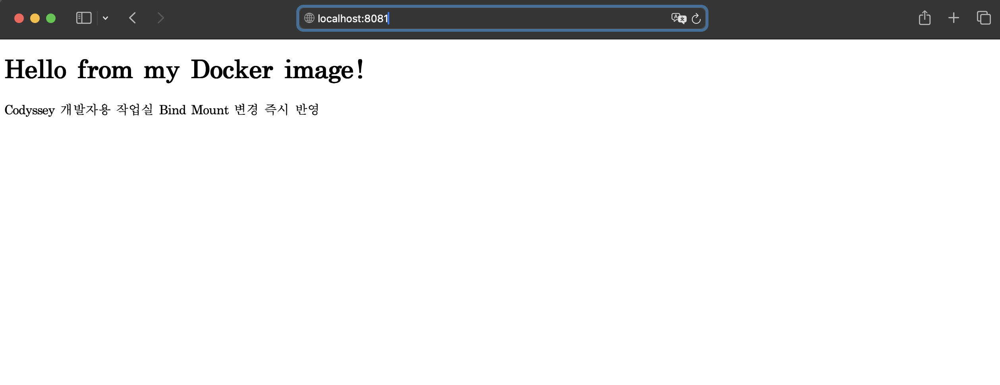
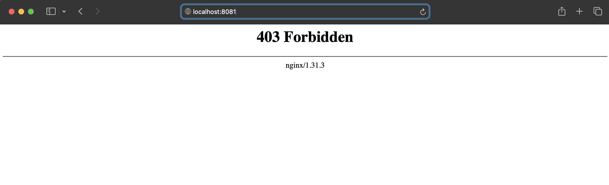

# 내 컴퓨터에 개발자용 작업실 꾸미기

## 1. 프로젝트 개요

macOS 환경에서 터미널 명령어, 파일 및 디렉터리 권한, Docker 이미지와 컨테이너, Dockerfile, 포트 매핑, Bind Mount, Docker Volume, Git과 GitHub 연동 과정을 실습해 개발 워크스테이션을 구축했다.

각 기능을 명령어로 직접 실행하고, 출력 로그와 브라우저 접속 화면을 통해 동작을 검증했다.

---

## 2. 실행 환경

| 구분 | 환경 |
|---|---|
| 운영체제 | macOS |
| 터미널 | macOS Terminal |
| 셸 | zsh |
| Docker 실행 환경 | OrbStack |
| Docker 버전 | 28.5.2 |
| Git 버전 | 2.53.0 |
| 편집기 | Visual Studio Code |
| 작업 경로 | `/Users/<username>/codyssey-workstation` |

---

## 3. 수행 항목 체크리스트

- [x] 터미널 기본 명령어 실습
- [x] 파일 및 디렉터리 생성·복사·이동·삭제
- [x] 파일 및 디렉터리 권한 변경
- [x] Docker 설치 및 실행 환경 점검
- [x] Docker 이미지 다운로드 및 조회
- [x] Docker 컨테이너 실행·조회·로그·자원 사용량 확인
- [x] Ubuntu 컨테이너 접속
- [x] Dockerfile 기반 웹 서버 이미지 생성
- [x] 포트 매핑 및 브라우저 접속
- [x] Bind Mount 변경 사항 반영
- [x] Docker Volume 데이터 영속성 확인
- [x] Git 저장소 초기화
- [x] Git 사용자 정보 및 `main` 브랜치 설정
- [ ] GitHub 공개 저장소 생성 및 Push
- [ ] VS Code GitHub 로그인 및 저장소 연동

---

## 4. 프로젝트 구조

```text
codyssey-workstation/
├── .gitignore
├── README.md
├── original.txt
├── docker-web/
│   ├── Dockerfile
│   └── index.html
└── images/
    ├── port-mapping-8080.png
    ├── bind-mount-after.png
    ├── troubleshooting-403.png
    └── vscode-github.png
```

- 웹 서버 소스: [`docker-web/index.html`](docker-web/index.html)
- Dockerfile: [`docker-web/Dockerfile`](docker-web/Dockerfile)
- 실행 증거 이미지: [`images/`](images/)

Git은 빈 디렉터리를 추적하지 않으므로 파일이 없는 `backup/` 디렉터리는 GitHub에서 보이지 않을 수 있다.

---

## 5. 터미널 및 파일 관리

### 5.1 현재 위치와 파일 확인

```bash
pwd
ls
ls -la
```

출력 예시:

```text
/Users/<username>/codyssey-workstation
```

`ls -la`를 이용해 일반 파일뿐 아니라 `.git`, `.gitignore` 같은 숨김 파일도 확인했다.

### 5.2 파일과 디렉터리 조작

```bash
mkdir codyssey-workstation
cd codyssey-workstation

touch original.txt
echo "Hello Codyssey" > original.txt

cp original.txt copied.txt
mv copied.txt renamed.txt

mkdir backup
mv renamed.txt backup/backrename.txt
rm backup/backrename.txt
```

- `cd`: 디렉터리 이동
- `cp`: 파일 복사
- `mv`: 파일 이동 또는 이름 변경
- `rm`: 파일 삭제
- `mkdir`: 디렉터리 생성

---

## 6. 파일 및 디렉터리 권한

권한 숫자의 의미는 다음과 같다.

```text
읽기 r = 4
쓰기 w = 2
실행 x = 1
```

### 6.1 파일 권한 변경

```bash
chmod 600 original.txt
ls -l original.txt
```

```text
-rw------- ... original.txt
```

소유자만 읽고 쓸 수 있도록 설정했다.

일반적인 파일 권한으로 복구했다.

```bash
chmod 644 original.txt
```

```text
-rw-r--r-- ... original.txt
```

### 6.2 디렉터리 권한 변경

```bash
chmod 700 backup
chmod 755 backup
```

- `700`: 소유자만 디렉터리에 접근 가능
- `755`: 소유자는 읽기·쓰기·진입 가능, 나머지는 읽기·진입 가능

파일의 실행 권한은 파일을 프로그램으로 실행할 수 있다는 의미이고, 디렉터리의 실행 권한은 해당 디렉터리 내부로 진입할 수 있다는 의미이다.

---

## 7. Docker 설치 및 환경 점검

학교 공용 macOS 환경에서 관리자 권한 제약이 있어 OrbStack을 이용해 Docker를 실행했다.

### 7.1 Docker 버전

```bash
docker --version
```

```text
Docker version 28.5.2, build ecc6942
```

### 7.2 Docker 실행 환경

```bash
docker info
```

핵심 확인 결과:

```text
Context: orbstack
Server Version: 28.5.2
Operating System: OrbStack
OSType: linux
Architecture: x86_64
CPUs: 6
Total Memory: 15.67GiB
```

Docker 클라이언트와 OrbStack의 Docker 서버가 정상적으로 연결된 것을 확인했다.

---

## 8. Docker 이미지와 컨테이너 운영

### 8.1 이미지 조회 및 다운로드

```bash
docker images
docker pull hello-world
docker image ls
```

확인된 이미지 예시:

```text
REPOSITORY     TAG       IMAGE ID       SIZE
hello-world    latest    e2ac70e7319a   10.1kB
codyssey-web   1.0       e16fc2eb2886   62.4MB
```

Docker 이미지는 컨테이너를 실행하는 데 필요한 파일과 설정을 담은 실행 설계도이다.

컨테이너는 이미지를 기반으로 실제 실행된 프로세스이다.

### 8.2 Hello World 컨테이너

```bash
docker run hello-world
```

핵심 출력:

```text
Hello from Docker!
This message shows that your installation appears to be working correctly.
```

실행 중인 컨테이너를 조회했다.

```bash
docker ps
```

`hello-world`는 메시지를 출력하고 바로 종료되므로 실행 중인 목록에는 나타나지 않았다.

종료된 컨테이너까지 조회했다.

```bash
docker ps -a
```

```text
CONTAINER ID   IMAGE         STATUS
8f069d42ffee   hello-world   Exited (0)
```

컨테이너 로그를 확인했다.

```bash
docker logs 8f069d42ffee
```

```text
Hello from Docker!
```

---

## 9. Ubuntu 컨테이너

Ubuntu 이미지를 내려받았다.

```bash
docker pull ubuntu:latest
```

백그라운드에서 Ubuntu 컨테이너를 실행했다.

```bash
docker run -dit --name ubuntu-lab ubuntu bash
```

실행 상태를 확인했다.

```bash
docker ps
```

```text
IMAGE     STATUS    NAMES
ubuntu    Up        ubuntu-lab
```

자원 사용량을 확인했다.

```bash
docker stats --no-stream ubuntu-lab
```

출력 예시:

```text
NAME         CPU %    MEM USAGE / LIMIT       PIDS
ubuntu-lab   0.00%    1.715MiB / 15.67GiB     1
```

컨테이너 내부에 접속했다.

```bash
docker exec -it ubuntu-lab bash
```

컨테이너 내부에서 다음 명령을 실행했다.

```bash
pwd
ls
echo "Hello from Ubuntu container"
```

출력:

```text
/
Hello from Ubuntu container
```

`exit`로 내부 셸에서 빠져나온 뒤에도 백그라운드 컨테이너는 계속 실행됐다.

### Attach와 Detach

```bash
docker attach ubuntu-lab
```

컨테이너를 종료하지 않고 빠져나오기 위해 다음 키를 순서대로 입력했다.

```text
Control + P
Control + Q
```

`Command` 키가 아니라 `Control` 키를 사용해야 한다.

---

## 10. Dockerfile 기반 웹 서버

### 10.1 웹 서버 소스

웹 서버 페이지는 [`docker-web/index.html`](docker-web/index.html)에 작성했다.

```html
<!doctype html>
<html lang="ko">
<head>
  <meta charset="UTF-8">
  <meta name="viewport" content="width=device-width, initial-scale=1.0">
  <title>Codyssey Docker Web</title>
</head>
<body>
  <h1>Hello from my Docker image!</h1>
  <p>Codyssey 개발자용 작업실 Bind Mount 변경 즉시 반영</p>
</body>
</html>
```

### 10.2 Dockerfile

[`docker-web/Dockerfile`](docker-web/Dockerfile)

```dockerfile
FROM nginx:alpine
COPY index.html /usr/share/nginx/html/index.html
EXPOSE 80
```

- `FROM`: 기반 이미지 지정
- `COPY`: 호스트 파일을 이미지 내부로 복사
- `EXPOSE`: 컨테이너가 사용하는 포트 정보 표시

`EXPOSE`는 포트 정보를 문서화하지만, 호스트 포트를 실제로 연결하지는 않는다.

### 10.3 이미지 빌드

```bash
cd docker-web
docker build -t codyssey-web:1.0 .
```

핵심 결과:

```text
[+] Building 7.0s (7/7) FINISHED
```

생성된 이미지를 확인했다.

```bash
docker image ls codyssey-web
```

```text
REPOSITORY     TAG    IMAGE ID       SIZE
codyssey-web   1.0    e16fc2eb2886   62.4MB
```

---

## 11. 포트 매핑

다음 명령으로 호스트의 8080번 포트와 컨테이너의 80번 포트를 연결했다.

```bash
docker run -d \
  --name codyssey-web-container \
  -p 8080:80 \
  codyssey-web:1.0
```

연결 구조:

```text
브라우저 localhost:8080
          ↓
호스트 8080번 포트
          ↓
컨테이너 80번 포트
          ↓
Nginx 웹 서버
```

브라우저에서 다음 주소에 접속해 웹 페이지를 확인했다.

```text
http://localhost:8080
```

### 포트 매핑 접속 증거



주소창의 `localhost:8080`과 커스텀 웹 페이지가 함께 표시되는 것을 확인했다.

---

## 12. Bind Mount

Bind Mount는 호스트의 파일이나 디렉터리를 컨테이너의 경로에 직접 연결하는 기능이다.

다음 명령으로 macOS의 `index.html`과 컨테이너의 Nginx 페이지를 연결했다.

```bash
docker run -d \
  --name bind-web \
  -p 8081:80 \
  -v "$(pwd)/index.html:/usr/share/nginx/html/index.html:ro" \
  nginx:alpine
```

`ro`는 컨테이너가 파일을 읽기 전용으로 사용하도록 설정한다.

### 12.1 변경 전

```text
Codyssey 개발자용 작업실 구축 완료
```

### 12.2 호스트 파일 변경

```bash
sed -i '' \
  's/구축 완료/Bind Mount 변경 즉시 반영/' \
  index.html
```

### 12.3 변경 후

```text
Codyssey 개발자용 작업실 Bind Mount 변경 즉시 반영
```

이미지를 다시 빌드하거나 컨테이너를 다시 생성하지 않고 브라우저 새로고침만으로 변경 내용이 반영됐다.

### Bind Mount 반영 증거



HTTP 요청으로도 정상 동작을 확인했다.

```bash
curl -i http://localhost:8081/
```

```text
HTTP/1.1 200 OK
Content-Type: text/html
Content-Length: 318
```

---

## 13. Docker Volume 영속성

Docker Volume은 Docker가 관리하는 별도의 데이터 저장공간이다.

```text
Bind Mount
- 호스트의 파일 또는 디렉터리를 직접 연결
- 개발 중인 소스 코드 공유에 적합

Docker Volume
- Docker가 관리하는 저장공간 사용
- 컨테이너가 삭제되어도 유지해야 하는 데이터에 적합
```

### 13.1 Volume 생성

```bash
docker volume create codyssey-data
```

출력:

```text
codyssey-data
```

### 13.2 첫 번째 컨테이너에서 데이터 저장

```bash
docker run \
  --name volume-writer \
  -v codyssey-data:/data \
  alpine \
  sh -c 'echo "persistent data from first container" > /data/message.txt'
```

컨테이너의 종료 상태를 확인했다.

```bash
docker ps -a --filter name=volume-writer
```

```text
CONTAINER ID   IMAGE    STATUS       NAMES
eb27c38ff140   alpine   Exited (0)   volume-writer
```

### 13.3 컨테이너 삭제

```bash
docker rm volume-writer
```

출력:

```text
volume-writer
```

삭제 후 목록을 확인했다.

```bash
docker ps -a --filter name=volume-writer
```

```text
CONTAINER ID   IMAGE   COMMAND   CREATED   STATUS   PORTS   NAMES
```

제목 행만 출력되고 `volume-writer`는 나타나지 않아 컨테이너가 삭제된 것을 확인했다.

### 13.4 새로운 컨테이너에서 기존 데이터 확인

```bash
docker run --rm \
  -v codyssey-data:/data \
  alpine \
  cat /data/message.txt
```

출력:

```text
persistent data from first container
```

첫 번째 컨테이너를 삭제했지만 새로운 컨테이너에서 같은 Volume을 연결하자 기존 데이터를 읽을 수 있었다.

따라서 컨테이너와 Volume의 생명주기는 서로 다르며, Volume을 직접 삭제하지 않으면 데이터가 유지된다는 것을 확인했다.

---

## 14. Git 설정

Git 버전을 확인했다.

```bash
git --version
```

```text
git version 2.53.0
```

현재 프로젝트를 Git 저장소로 초기화했다.

```bash
git init
```

현재 브랜치 이름을 `main`으로 변경했다.

```bash
git branch -m main
```

공용 컴퓨터 전체에 적용되지 않도록 현재 저장소에만 Git 사용자 정보를 설정했다.

```bash
git config user.name "KimGemini"
git config user.email "<GitHub noreply email>"
```

설정 결과를 확인했다.

```bash
git config --local --list
```

확인된 항목:

```text
user.name=KimGemini
user.email=<GitHub noreply email>
```

실제 이메일, 비밀번호, 토큰 등의 민감정보는 문서에 기록하지 않았다.

---

## 15. 검증 방법 및 결과 위치

| 수행 항목 | 검증 명령 또는 방법 | 결과 | 증거 위치 |
|---|---|---|---|
| 터미널 | `pwd`, `ls -la` | 작업 경로와 파일 확인 | README 5장 |
| 권한 | `chmod`, `ls -l` | 파일·디렉터리 권한 변경 확인 | README 6장 |
| Docker 설치 | `docker --version`, `docker info` | Docker 클라이언트와 서버 정상 연결 | README 7장 |
| 이미지 | `docker images`, `docker image ls` | 이미지 다운로드 및 생성 확인 | README 8장 |
| 컨테이너 | `docker ps -a` | 실행·종료 컨테이너 확인 | README 8~9장 |
| 로그 | `docker logs` | 컨테이너 출력 확인 | README 8장 |
| 자원 사용량 | `docker stats --no-stream` | CPU·메모리 사용량 확인 | README 9장 |
| Dockerfile | `docker build` | 커스텀 이미지 빌드 성공 | [`Dockerfile`](docker-web/Dockerfile) |
| 포트 매핑 | 브라우저 `localhost:8080` | 웹 페이지 접속 성공 | [포트 매핑 이미지](images/port-mapping-8080.png) |
| Bind Mount | 파일 변경 후 브라우저 새로고침 | 재빌드 없이 변경 반영 | [Bind Mount 이미지](images/bind-mount-after.png) |
| Volume | 컨테이너 삭제 후 새 컨테이너에서 `cat` | 기존 데이터 유지 | README 13장 |
| Git | `git config --local --list` | 저장소 전용 사용자 정보 확인 | README 14장 |
| GitHub·VS Code | 완료 후 추가 | 원격 저장소 연동 확인 | `images/vscode-github.png` |

---

## 16. 트러블슈팅

### 16.1 OrbStack 실행 후 Docker 명령을 찾지 못함

#### 문제

OrbStack을 실행했지만 기존 터미널에서 다음 오류가 발생했다.

```text
zsh: command not found: docker
```

#### 원인 가설

OrbStack 설치 또는 초기 설정 과정에서 명령어 경로가 변경됐지만, 이미 열려 있던 터미널 세션이 변경된 PATH를 반영하지 못한 것으로 추정했다.

#### 확인

기존 터미널에서는 `docker`와 `orb` 명령을 찾지 못했다.

#### 해결

터미널을 완전히 종료하고 다시 실행한 뒤 다음 명령을 확인했다.

```bash
docker --version
docker info
```

Docker 버전과 OrbStack 서버 정보가 정상적으로 출력됐다.

---

### 16.2 Bind Mount 파일 수정 후 403 Forbidden 발생

#### 문제

Bind Mount로 연결된 `index.html`을 수정한 직후 브라우저에서 다음 오류가 일시적으로 발생했다.

```text
403 Forbidden
```

오류 화면:



#### 원인 가설

macOS의 `sed -i`가 임시 파일을 생성한 뒤 기존 파일을 교체하는 과정에서 단일 파일 Bind Mount와 Nginx의 인덱스 탐색 상태가 일시적으로 어긋났을 가능성을 고려했다.

다만 내부 원인을 완전히 확정하지 않고 파일 존재 여부, 권한, Nginx 로그, HTTP 응답을 차례로 확인했다.

#### 확인 1: Nginx 로그

```bash
docker logs --tail 20 bind-web
```

핵심 로그:

```text
directory index of "/usr/share/nginx/html/" is forbidden
GET / HTTP/1.1" 403
```

#### 확인 2: 파일 존재 여부

```bash
docker exec bind-web ls -l /usr/share/nginx/html/index.html
```

```text
-rw-r--r-- 1 root root 318 ... index.html
```

#### 확인 3: root 사용자 읽기

```bash
docker exec bind-web cat /usr/share/nginx/html/index.html
```

변경된 HTML 내용이 정상 출력됐다.

#### 확인 4: nginx 사용자 읽기

```bash
docker exec -u nginx bind-web \
  cat /usr/share/nginx/html/index.html
```

Nginx 사용자도 파일을 정상적으로 읽었다.

#### 해결 및 결과

HTTP 요청을 직접 전송했다.

```bash
curl -i http://localhost:8081/index.html
curl -i http://localhost:8081/
```

최종 결과:

```text
HTTP/1.1 200 OK
```

브라우저를 다시 새로고침하자 변경된 페이지가 정상적으로 표시됐다.

Bind Mount 연결, 파일 권한, Nginx의 최종 응답이 정상인 것을 확인했다. 오류는 일시적인 상태로 판단했지만, 정확한 내부 원인은 확정하지 않았다.

---

## 17. GitHub 및 VS Code 연동

GitHub 공개 저장소를 생성하고 로컬 Git 저장소를 연결한다.

```bash
git remote add origin <GitHub repository URL>
git add .
git commit -m "Complete developer workstation setup"
git push -u origin main
```

VS Code에서 GitHub 계정에 로그인한 뒤 현재 프로젝트와 원격 저장소가 연결된 것을 확인한다.

연동 완료 증거:

```text
images/vscode-github.png
```