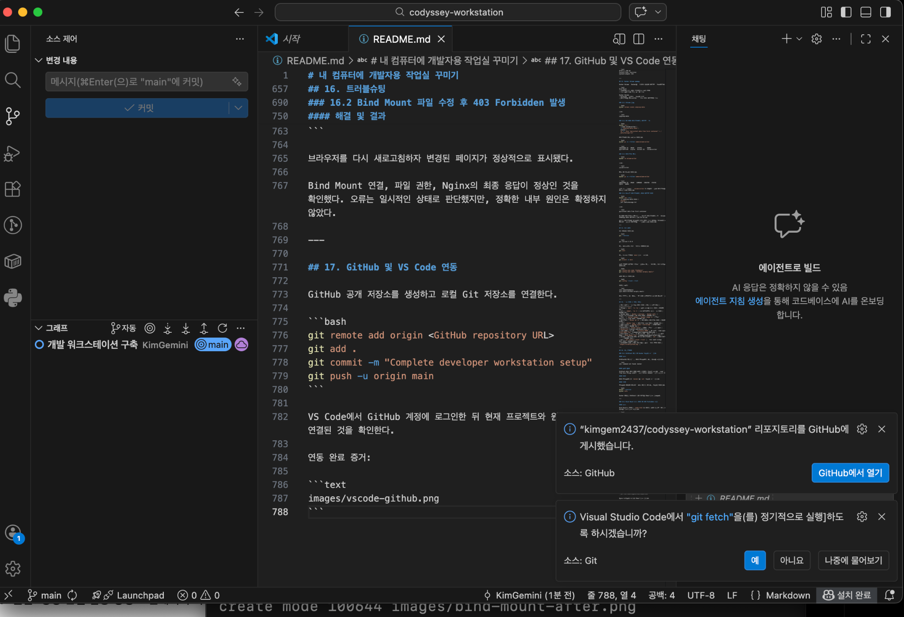

# 내 컴퓨터에 개발자용 작업실 꾸미기

## 1. 프로젝트 개요

macOS 환경에서 터미널 명령어와 파일 권한을 학습하고, Docker 이미지·컨테이너·Dockerfile·포트 매핑·Bind Mount·Volume을 이용해 개발 워크스테이션을 구축했다.

Git으로 수행 결과를 버전 관리하고, Visual Studio Code에서 GitHub 계정과 원격 저장소를 연동해 공개 저장소에 게시했다.

### 미션 목표

- 터미널 기본 명령어와 파일 시스템 이해
- 파일 및 디렉터리 권한 변경
- Docker 설치 및 실행 환경 검증
- 이미지와 컨테이너의 차이 이해
- Dockerfile 기반 웹 서버 이미지 제작
- 포트 매핑을 통한 웹 페이지 접속
- Bind Mount를 통한 소스 변경 즉시 반영
- Docker Volume의 데이터 영속성 검증
- Git 및 GitHub를 이용한 결과물 관리
- VS Code와 GitHub 저장소 연동

### GitHub 저장소

[https://github.com/kimgem2437/codyssey-workstation](https://github.com/kimgem2437/codyssey-workstation)

---

## 2. 실행 환경

| 구분 | 환경 |
|---|---|
| 운영체제 | macOS |
| 터미널 | macOS Terminal |
| 셸 | zsh |
| Docker 실행 환경 | OrbStack |
| Docker 버전 | 28.5.2 |
| Docker 서버 OS | OrbStack Linux |
| Git 버전 | 2.53.0 |
| 편집기 | Visual Studio Code |
| 작업 경로 | `/Users/<username>/codyssey-workstation` |

실제 사용자 홈 디렉터리명과 이메일 주소는 공개 문서에 기록하지 않았다.

---

## 3. 수행 항목 체크리스트

- [x] 터미널 기본 명령어 실행
- [x] 파일 및 디렉터리 생성·복사·이동·삭제
- [x] 파일 및 디렉터리 권한 변경
- [x] Docker 설치 및 실행 환경 확인
- [x] Docker 이미지 다운로드 및 조회
- [x] Docker 컨테이너 실행 및 종료 상태 확인
- [x] 컨테이너 로그 확인
- [x] 컨테이너 자원 사용량 확인
- [x] Ubuntu 컨테이너 접속
- [x] Dockerfile 기반 웹 서버 이미지 생성
- [x] 포트 매핑 및 브라우저 접속
- [x] Bind Mount 변경 전·후 비교
- [x] Docker Volume 데이터 영속성 확인
- [x] Git 저장소 초기화
- [x] Git 사용자 정보 설정
- [x] 기본 브랜치 `main` 설정
- [x] GitHub 공개 저장소 생성 및 Push
- [x] VS Code GitHub 로그인 및 저장소 연동
- [x] 트러블슈팅 2건 이상 기록

---

## 4. 프로젝트 구조

```text
codyssey-workstation/
├── .gitignore
├── README.md
├── original.txt
├── docker-web/
│   ├── Dockerfile
│   └── index.html
└── images/
    ├── port-mapping-8080.png
    ├── bind-mount-after.png
    ├── troubleshooting-403.png
    └── vscode-github.png
```

### 주요 결과물

- 웹 서버 소스: [`docker-web/index.html`](docker-web/index.html)
- Dockerfile: [`docker-web/Dockerfile`](docker-web/Dockerfile)
- 실행 증거 이미지: [`images/`](images/)

`backup/` 디렉터리도 생성했지만, Git은 빈 디렉터리를 추적하지 않기 때문에 GitHub 저장소에는 표시되지 않을 수 있다.

---

## 5. 터미널 및 파일 관리

### 5.1 현재 작업 위치 확인

```bash
pwd
```

출력:

```text
/Users/<username>/codyssey-workstation
```

### 5.2 파일 목록 확인

```bash
ls
ls -la
```

`ls -la`를 이용해 일반 파일뿐 아니라 `.git`, `.gitignore`와 같은 숨김 파일도 확인했다.

### 5.3 파일과 디렉터리 조작

```bash
mkdir codyssey-workstation
cd codyssey-workstation

touch original.txt
echo "Hello Codyssey" > original.txt

cp original.txt copied.txt
mv copied.txt renamed.txt

mkdir backup
mv renamed.txt backup/backrename.txt
rm backup/backrename.txt
```

각 명령의 역할은 다음과 같다.

| 명령 | 역할 |
|---|---|
| `pwd` | 현재 작업 경로 확인 |
| `ls` | 파일 및 디렉터리 목록 확인 |
| `mkdir` | 디렉터리 생성 |
| `touch` | 빈 파일 생성 또는 수정 시간 갱신 |
| `cp` | 파일 복사 |
| `mv` | 파일 이동 또는 이름 변경 |
| `rm` | 파일 삭제 |
| `cd` | 디렉터리 이동 |

### 5.4 파일 수정 시간 확인

```bash
stat -f "마지막 수정 시간: %Sm" \
  -t "%Y-%m-%d %H:%M:%S" \
  original.txt
```

`touch original.txt` 실행 전·후의 수정 시간을 비교해 `touch`가 기존 파일의 수정 시간을 갱신한다는 것을 확인했다.

---

## 6. 파일 및 디렉터리 권한

권한에 사용되는 숫자의 의미는 다음과 같다.

```text
읽기 r = 4
쓰기 w = 2
실행 x = 1
```

### 6.1 파일 권한 변경

소유자만 파일을 읽고 쓸 수 있도록 변경했다.

```bash
chmod 600 original.txt
ls -l original.txt
```

출력 형태:

```text
-rw------- ... original.txt
```

일반적인 파일 권한으로 복구했다.

```bash
chmod 644 original.txt
ls -l original.txt
```

출력 형태:

```text
-rw-r--r-- ... original.txt
```

### 6.2 디렉터리 권한 변경

소유자만 디렉터리에 접근할 수 있도록 변경했다.

```bash
chmod 700 backup
```

일반적인 디렉터리 권한으로 복구했다.

```bash
chmod 755 backup
```

권한의 의미:

- `600`: 소유자만 읽기·쓰기 가능
- `644`: 소유자는 읽기·쓰기, 나머지는 읽기 가능
- `700`: 소유자만 디렉터리 접근 가능
- `755`: 소유자는 모든 권한, 나머지는 읽기·진입 가능

파일의 실행 권한은 파일을 프로그램으로 실행할 수 있다는 뜻이다.

디렉터리의 실행 권한은 해당 디렉터리 안으로 진입할 수 있다는 뜻이다.

---

## 7. Docker 설치 및 환경 점검

학교 공용 macOS 환경에서 관리자 권한 제약이 있어 OrbStack을 이용해 Docker를 실행했다.

### 7.1 Docker 버전 확인

```bash
docker --version
```

출력:

```text
Docker version 28.5.2, build ecc6942
```

### 7.2 Docker 실행 환경 확인

```bash
docker info
```

핵심 확인 결과:

```text
Context: orbstack
Server Version: 28.5.2
Operating System: OrbStack
OSType: linux
Architecture: x86_64
CPUs: 6
Total Memory: 15.67GiB
```

Docker 클라이언트가 OrbStack에서 실행되는 Docker 서버와 정상적으로 연결된 것을 확인했다.

---

## 8. Docker 이미지 운영

### 8.1 이미지 목록 확인

```bash
docker images
```

처음에는 로컬 Docker 이미지가 없는 상태였다.

### 8.2 Hello World 이미지 다운로드

```bash
docker pull hello-world
```

이미지를 다시 확인했다.

```bash
docker image ls
```

출력:

```text
REPOSITORY    TAG       IMAGE ID       SIZE
hello-world   latest    e2ac70e7319a   10.1kB
```

Docker 이미지는 컨테이너 실행에 필요한 파일과 설정을 담은 실행 설계도이다.

컨테이너는 이미지를 기반으로 실제 실행된 프로세스이다.

```text
이미지    = 실행 전 설계도
컨테이너  = 이미지를 기반으로 실행된 환경
```

---

## 9. Hello World 컨테이너

### 9.1 컨테이너 실행

```bash
docker run hello-world
```

핵심 출력:

```text
Hello from Docker!
This message shows that your installation appears to be working correctly.
```

### 9.2 실행 중인 컨테이너 확인

```bash
docker ps
```

`hello-world` 컨테이너는 메시지를 출력한 뒤 바로 종료되기 때문에 실행 중인 목록에는 표시되지 않았다.

### 9.3 종료된 컨테이너 포함 확인

```bash
docker ps -a
```

출력:

```text
CONTAINER ID   IMAGE         STATUS       NAMES
8f069d42ffee   hello-world   Exited (0)   relaxed_jepsen
```

`Exited (0)`은 오류 없이 정상 종료됐다는 의미이다.

### 9.4 컨테이너 로그 확인

```bash
docker logs 8f069d42ffee
```

출력:

```text
Hello from Docker!
```

컨테이너를 다시 실행하지 않고도 이전 실행 결과를 로그로 확인할 수 있었다.

---

## 10. Ubuntu 컨테이너 운영

### 10.1 Ubuntu 이미지 다운로드

```bash
docker pull ubuntu:latest
```

### 10.2 백그라운드 컨테이너 실행

```bash
docker run -dit \
  --name ubuntu-lab \
  ubuntu \
  bash
```

### 10.3 실행 상태 확인

```bash
docker ps
```

출력 형태:

```text
IMAGE     STATUS    NAMES
ubuntu    Up        ubuntu-lab
```

### 10.4 자원 사용량 확인

```bash
docker stats --no-stream ubuntu-lab
```

출력:

```text
NAME         CPU %    MEM USAGE / LIMIT       PIDS
ubuntu-lab   0.00%    1.715MiB / 15.67GiB     1
```

`docker stats`를 이용해 CPU, 메모리, 네트워크, 프로세스 수 등을 확인할 수 있었다.

### 10.5 컨테이너 내부 접속

```bash
docker exec -it ubuntu-lab bash
```

컨테이너 내부에서 다음 명령을 실행했다.

```bash
pwd
ls
echo "Hello from Ubuntu container"
```

출력:

```text
/
Hello from Ubuntu container
```

`exit`로 내부 셸에서 나와도 백그라운드 컨테이너는 계속 실행됐다.

### 10.6 Attach와 Detach

실행 중인 컨테이너의 기본 터미널에 연결했다.

```bash
docker attach ubuntu-lab
```

컨테이너를 종료하지 않고 빠져나오기 위해 다음 키를 순서대로 입력했다.

```text
Control + P
Control + Q
```

출력:

```text
read escape sequence
```

`Command` 키가 아니라 `Control` 키를 사용해야 한다.

### 10.7 컨테이너 중지

```bash
docker stop ubuntu-lab
```

종료 상태를 확인했다.

```bash
docker ps -a
```

출력 형태:

```text
ubuntu-lab   Exited (137)
```

`137`은 컨테이너 프로세스가 종료 신호를 받아 중지된 상태를 의미한다.

---

## 11. Dockerfile 기반 웹 서버

### 11.1 웹 서버 소스

웹 페이지는 [`docker-web/index.html`](docker-web/index.html)에 작성했다.

```html
<!doctype html>
<html lang="ko">
<head>
  <meta charset="UTF-8">
  <meta name="viewport" content="width=device-width, initial-scale=1.0">
  <title>Codyssey Docker Web</title>
</head>
<body>
  <h1>Hello from my Docker image!</h1>
  <p>Codyssey 개발자용 작업실 Bind Mount 변경 즉시 반영</p>
</body>
</html>
```

### 11.2 Dockerfile

[`docker-web/Dockerfile`](docker-web/Dockerfile)

```dockerfile
FROM nginx:alpine
COPY index.html /usr/share/nginx/html/index.html
EXPOSE 80
```

각 명령의 의미:

- `FROM`: 기반으로 사용할 이미지 지정
- `COPY`: 호스트의 파일을 이미지 내부로 복사
- `EXPOSE`: 컨테이너가 사용하는 포트 정보 기록

`EXPOSE 80`은 포트를 문서화하지만 호스트 컴퓨터의 포트를 실제로 연결하지는 않는다.

### 11.3 커스텀 이미지 빌드

```bash
cd docker-web
docker build -t codyssey-web:1.0 .
```

핵심 출력:

```text
[+] Building 7.0s (7/7) FINISHED
```

생성된 이미지 확인:

```bash
docker image ls codyssey-web
```

출력:

```text
REPOSITORY     TAG    IMAGE ID       SIZE
codyssey-web   1.0    e16fc2eb2886   62.4MB
```

---

## 12. 포트 매핑

호스트의 8080번 포트와 컨테이너의 80번 포트를 연결했다.

```bash
docker run -d \
  --name codyssey-web-container \
  -p 8080:80 \
  codyssey-web:1.0
```

연결 구조:

```text
브라우저 localhost:8080
          ↓
호스트의 8080번 포트
          ↓
컨테이너의 80번 포트
          ↓
Nginx 웹 서버
```

브라우저 접속 주소:

```text
http://localhost:8080
```

### 포트 매핑 접속 성공 증거


주소창의 `localhost:8080`과 커스텀 웹 페이지가 함께 표시되는 것을 확인했다.

---

## 13. Bind Mount

Bind Mount는 호스트 컴퓨터의 파일 또는 디렉터리를 컨테이너 경로에 직접 연결하는 기능이다.

다음 명령으로 macOS의 `index.html`과 Nginx 컨테이너의 웹 페이지 파일을 연결했다.

```bash
docker run -d \
  --name bind-web \
  -p 8081:80 \
  -v "$(pwd)/index.html:/usr/share/nginx/html/index.html:ro" \
  nginx:alpine
```

옵션 설명:

- `-p 8081:80`: 호스트 8081번 포트를 컨테이너 80번 포트에 연결
- `-v`: Bind Mount 연결
- `:ro`: 컨테이너에서 파일을 읽기 전용으로 사용

### 13.1 변경 전

호스트 파일 변경 전 문구:

```text
Codyssey 개발자용 작업실 구축 완료
```

변경 전 페이지:


### 13.2 호스트 파일 변경

```bash
sed -i '' \
  's/구축 완료/Bind Mount 변경 즉시 반영/' \
  index.html
```

### 13.3 변경 후

호스트 파일 변경 후 문구:

```text
Codyssey 개발자용 작업실 Bind Mount 변경 즉시 반영
```

변경 후 페이지:


이미지를 다시 빌드하거나 컨테이너를 다시 생성하지 않았다.

호스트의 `index.html`을 수정한 뒤 브라우저를 새로고침하자 변경된 내용이 바로 표시됐다.

### 13.4 HTTP 응답 확인

```bash
curl -i http://localhost:8081/index.html
```

출력:

```text
HTTP/1.1 200 OK
Server: nginx/1.31.3
Content-Type: text/html
Content-Length: 318
```

루트 경로도 확인했다.

```bash
curl -i http://localhost:8081/
```

출력:

```text
HTTP/1.1 200 OK
```

Bind Mount 연결과 Nginx의 HTTP 응답이 정상인 것을 확인했다.

---

## 14. Docker Volume 영속성

Docker Volume은 Docker가 관리하는 별도의 데이터 저장공간이다.

```text
Bind Mount
- 호스트 파일 또는 디렉터리를 직접 연결
- 개발 중인 소스 코드 공유에 적합

Docker Volume
- Docker가 관리하는 저장공간 사용
- 컨테이너 삭제 후에도 유지할 데이터에 적합
```

### 14.1 Volume 생성

```bash
docker volume create codyssey-data
```

출력:

```text
codyssey-data
```

### 14.2 첫 번째 컨테이너에서 데이터 저장

```bash
docker run \
  --name volume-writer \
  -v codyssey-data:/data \
  alpine \
  sh -c 'echo "persistent data from first container" > /data/message.txt'
```

컨테이너 상태 확인:

```bash
docker ps -a --filter name=volume-writer
```

출력:

```text
CONTAINER ID   IMAGE    STATUS       NAMES
eb27c38ff140   alpine   Exited (0)   volume-writer
```

`Exited (0)`으로 파일 저장 명령이 정상 완료됐음을 확인했다.

### 14.3 첫 번째 컨테이너 삭제

```bash
docker rm volume-writer
```

출력:

```text
volume-writer
```

삭제 후 다시 조회했다.

```bash
docker ps -a --filter name=volume-writer
```

출력:

```text
CONTAINER ID   IMAGE   COMMAND   CREATED   STATUS   PORTS   NAMES
```

제목 행만 나오고 `volume-writer` 항목은 나타나지 않았다.

### 14.4 새로운 컨테이너에서 기존 데이터 확인

```bash
docker run --rm \
  -v codyssey-data:/data \
  alpine \
  cat /data/message.txt
```

출력:

```text
persistent data from first container
```

### 삭제 전·후 비교

| 단계 | 컨테이너 상태 | Volume 데이터 |
|---|---|---|
| 파일 저장 후 | `volume-writer`가 `Exited (0)` 상태로 존재 | 저장됨 |
| 컨테이너 삭제 후 | `volume-writer`가 목록에서 사라짐 | 유지됨 |
| 새 컨테이너 연결 후 | 임시 컨테이너 실행 후 자동 삭제 | 기존 데이터 읽기 성공 |

첫 번째 컨테이너를 삭제했지만, 새로운 컨테이너가 같은 Volume을 연결하자 기존 데이터를 읽을 수 있었다.

따라서 컨테이너와 Volume의 생명주기는 서로 다르며, Volume을 직접 삭제하지 않으면 데이터가 유지된다는 것을 확인했다.

---

## 15. Git 설정 및 버전 관리

### 15.1 Git 버전 확인

```bash
git --version
```

출력:

```text
git version 2.53.0
```

### 15.2 Git 저장소 초기화

```bash
git init
```

### 15.3 기본 브랜치 변경

```bash
git branch -m main
```

### 15.4 Git 사용자 정보 설정

공용 컴퓨터 전체에 설정이 남지 않도록 `--global`을 사용하지 않고 현재 저장소에만 사용자 정보를 설정했다.

```bash
git config user.name "KimGemini"
git config user.email "<GitHub noreply email>"
```

설정 확인:

```bash
git config --local --list
```

확인 결과:

```text
user.name=KimGemini
user.email=<GitHub noreply email>
```

실제 이메일, 비밀번호, 액세스 토큰 등의 민감정보는 문서에 기록하지 않았다.

### 15.5 `.gitignore`

GitHub에 올리면 안 되는 환경설정, 비밀정보, 로그 및 임시 파일을 제외했다.

```gitignore
# macOS
.DS_Store

# 환경변수 및 비밀정보
.env
.env.*
!.env.example
*.pem
*.key

# 로그
*.log

# IDE 개인 설정
.vscode/
.idea/

# 임시 파일
*.tmp
*.swp
```

### 15.6 첫 커밋

```bash
git add .
git commit -m "개발 워크스테이션 구축"
```

출력:

```text
[main (최상위-커밋) 98f71fa] 개발 워크스테이션 구축
8 files changed, 824 insertions(+)
```

---

## 16. GitHub 및 VS Code 연동

Visual Studio Code에서 현재 Git 저장소를 열었다.

```bash
code .
```

VS Code의 Source Control에서 현재 저장소와 `main` 브랜치가 정상적으로 인식되는 것을 확인했다.

VS Code의 GitHub 게시 기능을 사용해 다음 공개 저장소를 생성하고 로컬 커밋을 Push했다.

```text
kimgem2437/codyssey-workstation
```

저장소 주소:

[https://github.com/kimgem2437/codyssey-workstation](https://github.com/kimgem2437/codyssey-workstation)

VS Code 화면에서 다음 상태를 확인했다.

- GitHub 계정 `KimGemini` 로그인
- `main` 브랜치 인식
- GitHub 원격 저장소 게시 완료 알림
- VS Code Source Control과 GitHub 저장소 연동

### VS Code 및 GitHub 연동 증거



---

## 17. 검증 방법 및 결과 위치

| 수행 항목 | 검증 명령 또는 방법 | 확인 결과 | 증거 위치 |
|---|---|---|---|
| 터미널 | `pwd`, `ls -la` | 작업 경로와 파일 확인 | [README 5장](#5-터미널-및-파일-관리) |
| 파일 권한 | `chmod`, `ls -l` | 파일·디렉터리 권한 변경 | [README 6장](#6-파일-및-디렉터리-권한) |
| Docker 설치 | `docker --version` | Docker 28.5.2 확인 | [README 7장](#7-docker-설치-및-환경-점검) |
| Docker 서버 | `docker info` | OrbStack 서버 연결 확인 | [README 7장](#7-docker-설치-및-환경-점검) |
| 이미지 | `docker images`, `docker image ls` | 이미지 다운로드 및 빌드 확인 | [README 8장](#8-docker-이미지-운영) |
| 컨테이너 | `docker ps -a` | 실행·종료 컨테이너 확인 | [README 9장](#9-hello-world-컨테이너) |
| 로그 | `docker logs` | 컨테이너 실행 로그 확인 | [README 9장](#9-hello-world-컨테이너) |
| 자원 사용량 | `docker stats --no-stream` | CPU·메모리 확인 | [README 10장](#10-ubuntu-컨테이너-운영) |
| Dockerfile | `docker build` | 커스텀 이미지 빌드 성공 | [`Dockerfile`](docker-web/Dockerfile) |
| 웹 소스 | Nginx에서 HTML 제공 | 페이지 출력 확인 | [`index.html`](docker-web/index.html) |
| 포트 매핑 | `localhost:8080` 브라우저 접속 | 웹 페이지 접속 성공 | [포트 매핑 이미지](images/port-mapping-8080.png) |
| Bind Mount | 호스트 파일 수정 후 새로고침 | 재빌드 없이 변경 반영 | [Bind Mount 이미지](images/bind-mount-after.png) |
| HTTP 응답 | `curl -i` | `HTTP/1.1 200 OK` | [README 13장](#13-bind-mount) |
| Volume | 컨테이너 삭제 후 새 컨테이너에서 `cat` | 기존 데이터 유지 | [README 14장](#14-docker-volume-영속성) |
| Git 설정 | `git config --local --list` | 저장소 전용 설정 확인 | [README 15장](#15-git-설정-및-버전-관리) |
| GitHub 연동 | VS Code GitHub 게시 알림 | 공개 저장소 게시 완료 | [VS Code 연동 이미지](images/vscode-github.png) |

---

## 18. 트러블슈팅

## 18.1 OrbStack 실행 후 Docker 명령을 찾지 못함

### 문제

OrbStack을 실행했지만 기존 터미널에서 다음 오류가 발생했다.

```text
zsh: command not found: docker
```

`orb` 명령도 동일하게 찾지 못했다.

### 원인 가설

OrbStack 설치 또는 초기 설정 과정에서 Docker 명령어 경로가 추가됐지만, 이미 실행 중이던 터미널 세션이 변경된 PATH를 반영하지 못한 것으로 추정했다.

### 확인

기존 터미널 세션에서는 `docker --version`이 실패했다.

터미널을 완전히 종료한 뒤 새 터미널에서 다시 확인했다.

```bash
docker --version
docker info
```

### 해결

터미널을 완전히 종료한 뒤 다시 실행했다.

새 터미널에서는 Docker 버전과 OrbStack 서버 정보가 정상적으로 출력됐다.

```text
Docker version 28.5.2, build ecc6942
Context: orbstack
Server Version: 28.5.2
```

### 결과

Docker 명령어를 정상적으로 실행할 수 있었다.

---

## 18.2 Bind Mount 파일 수정 후 403 Forbidden 발생

### 문제

Bind Mount로 연결된 `index.html`을 수정한 직후 브라우저에서 다음 오류가 일시적으로 발생했다.

```text
403 Forbidden
```

오류 화면:


### 원인 가설

macOS의 `sed -i`가 임시 파일을 생성한 뒤 기존 파일을 교체하는 과정에서 단일 파일 Bind Mount와 Nginx의 인덱스 탐색 상태가 일시적으로 어긋났을 가능성을 고려했다.

다만 정확한 내부 원인은 확정하지 않고 다음 항목들을 차례로 확인했다.

- Nginx 로그
- 파일 존재 여부
- 파일 권한
- root 사용자의 파일 접근
- nginx 사용자의 파일 접근
- 직접 HTTP 요청 결과

### 확인 1: Nginx 로그

```bash
docker logs --tail 20 bind-web
```

핵심 로그:

```text
directory index of "/usr/share/nginx/html/" is forbidden
GET / HTTP/1.1" 403
```

### 확인 2: 파일 존재 여부와 권한

```bash
docker exec bind-web \
  ls -l /usr/share/nginx/html/index.html
```

출력:

```text
-rw-r--r-- 1 root root 318 ... index.html
```

파일은 정상적으로 존재했고 읽기 권한도 있었다.

### 확인 3: root 사용자 접근

```bash
docker exec bind-web \
  cat /usr/share/nginx/html/index.html
```

변경된 HTML 내용이 정상적으로 출력됐다.

### 확인 4: nginx 사용자 접근

```bash
docker exec -u nginx bind-web \
  cat /usr/share/nginx/html/index.html
```

Nginx 작업 사용자도 파일을 정상적으로 읽을 수 있었다.

따라서 단순한 파일 부재나 읽기 권한 문제는 아니었다.

### 해결 및 대안

HTTP 요청을 직접 전송해 현재 응답 상태를 확인했다.

```bash
curl -i http://localhost:8081/index.html
curl -i http://localhost:8081/
```

최종 결과:

```text
HTTP/1.1 200 OK
```

브라우저를 다시 새로고침하자 변경된 페이지가 정상적으로 표시됐다.

### 결과

- Bind Mount 연결 정상
- 파일 존재 및 권한 정상
- root 사용자 읽기 정상
- nginx 사용자 읽기 정상
- Nginx 최종 HTTP 응답 정상
- 브라우저 페이지 정상 복구

오류는 파일 수정 직후 발생한 일시적인 상태로 판단했지만, 정확한 내부 원인은 단정하지 않았다.

---

## 19. 최종 결과

다음 결과물을 GitHub 저장소 링크 하나로 확인할 수 있도록 구성했다.

- 프로젝트 개요와 수행 항목 체크리스트
- 터미널 기본 명령 및 권한 변경 기록
- Docker 설치·점검 및 운영 로그
- Dockerfile 기반 Nginx 웹 서버
- 포트 매핑 브라우저 접속 증거
- Bind Mount 변경 전·후 비교
- Docker Volume 컨테이너 삭제 전·후 비교
- 트러블슈팅 2건
- Git 설정 및 커밋 기록
- VS Code GitHub 로그인 및 원격 저장소 연동 증거
- 민감정보가 제외된 `.gitignore`